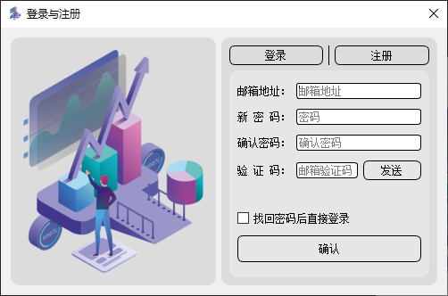

# QtLoginRegistration

#### 介绍
使用PyQt5+SQLAlchemy做的一个登录注册页，使用邮箱注册与验证，GUI 与登录注册逻辑未分离

#### 使用说明
[详见此处,点击前往](https://www.cnblogs.com/yqbaowo/p/17998599)

#### 运行截图
- 登录页  
  
- 注册页  
  
- 忘记密码页  
  
- 邮件样式  
  
#### 许可 
 [使用 GPL-3.0 license](https://www.gnu.org/licenses/gpl-3.0.html)